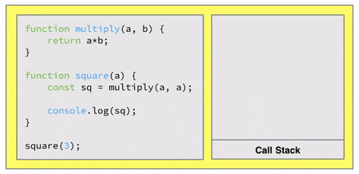

# Memory Management for JavaScript and browser

by Ozgur

---
layout: image-right
image: './images/transistors-city.jpeg'
---

# Browser is a VM

- Browser is a VM that runs JavaScript code.
- It has a memory management system that allocates memory for variables, objects, and functions and frees memory when they are not used anymore.
- It has its own memory part in operating system's memory.
- Browser uses a garbage collector to free memory. Garbage collector is a part of the memory management system.

---
layout: two-cols
---

# Memory Management in low level languages

- In low level languages like C, C++, and Rust, memory management is done manually by the developer.
- Variables, objects and functions are allocated via `pointers`.
- When there is a new allocation required, system allocates enough memory for the new data type and returns a pointer to that memory.
- If developer forgets to free memory after usage, it will cause memory leaks.
- It gives more control to the developer but it is also error prone.

::right::

```c
int main() {
  // alloc memory for 10 integers
  int *arr = malloc(10 * sizeof(int));

  // use arr
  for (int i = 0; i < 10; i++) {
    arr[i] = i;
    printf("%d ", arr[i]);
  }
  
  // free memory
  free(arr);
  
  return 0;
}
```

---
layout: center
---

# Memory Management in JavaScript

- In high level languages like JavaScript, memory management is done automatically by the browser.
- Browser allocates memory for variables, objects, and functions and frees memory when they are not used anymore.
- Instead of `pointers`, it uses `references` to access memory.
- `References` are differs from `pointers` in that they are not used to access memory directly.
- It gives less control to the developer but it is also less error prone.
- The system that frees memory is called `garbage collector`.

---
layout: image-right
image: './images/memory-management.jpeg'
---

# How memory is allocated in JavaScript?

- JavaScript engine also uses references to access memory.
- Memory is allocated in two places: `stack` and `heap`.
- `Stack` is used for primitive data types like `number`, `string`, `boolean`, `undefined`, and `null` and also function call stack.
- `Heap` is used for complex data types like `object` and `function`.

---
layout: center
---

# Stack

- Stack is used for primitive type as well as function calls (function execution). It's called `call stack`.

<br>

### Call stack:

- Call stack is a data structure that keeps track of function calls.
- When a function is called, it is added to the top of the call stack.
- When a function returns, it is removed from the top of the call stack.

---
layout: image
---



---

# Heap

- Heap is used for complex data types like `object`, `arrays`, and `function`.
- Heap is an unstructured memory space.
- JS engine allocates memory for complex data types in heap and keeps a reference to them in stack.

<br>

## Arrays

- When you define an array, JS engine allocates memory for it. 
- When you push a new item, it tries to use the same space and add new item. If it is not possible, it allocates a new space, copies items to the new space, marks the old array space as garbage (if there is no reference to it), and replaces old reference with new one.

## Objects

- It is also very similar for objects. When you add a new property to the object, JS engine will try to add it to the existing space or find a new space and copy the object to the new space.

---

# Heap / Functions

- Functions are also objects, so they are allocated in heap.
- When you define a function like `function foo() {}`, it is allocated in heap and a reference to it is kept in stack.
- Function's code is part of the object and therefore it is allocated in heap.
- If you define a function inside another function, it is allocated in heap. When the outer function returns, the inner function will get garbage collected eventually.
- Variable declarations within the function, including its arguments, and the value of `this` get stored in the call stack as the execution context when the function is invoked. This also includes closure scopes where the function has access to variables from its outer scopes.
- So, defining a function inside and outside of render will have different effects on memory usage.
- If you define a function inside a loop (render), it will be allocated in heap for each iteration. It may cause performance issues because each old render will be garbage collected and will bring calculation cost for garbage collector.
- Hopefully, we have powerful computers and these costs are not noticeable.

---
layout: image-right
image: './images/garbage-collector.jpeg'
---

# Garbage Collector

- Garbage collector is an mechanism that frees memory when it is not used anymore.
- It uses an algorithm called `mark and sweep`.

<br>

### Mark and Sweep:

- It marks all the variables, objects, and functions that are used.
- It consistently checks these marks and marks the ones that are not used anymore.
- After some time, it frees the memory of the ones that are not marked.
- It is a very efficient algorithm but after some time, it can cause performance issues.

---
layout: image-right
image: './images/question.jpeg'
---

# Question to you:

## How parameters are passed to functions in JavaScript? By value or by reference?

---
layout: image
---


